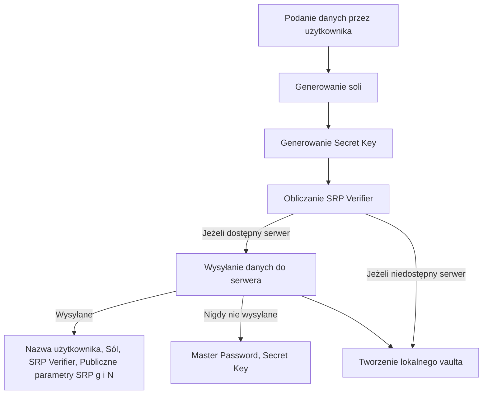
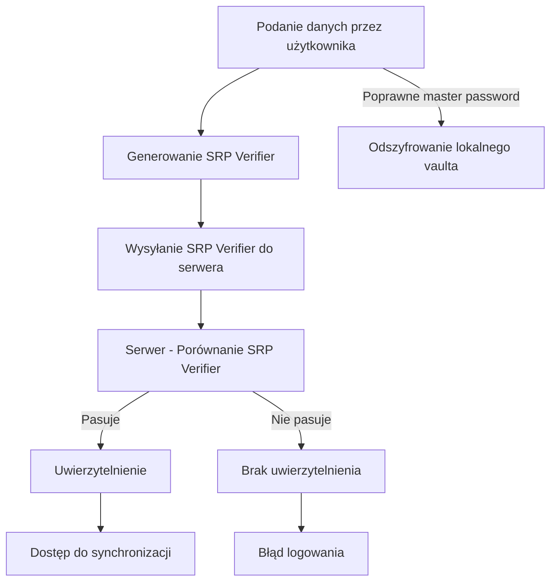
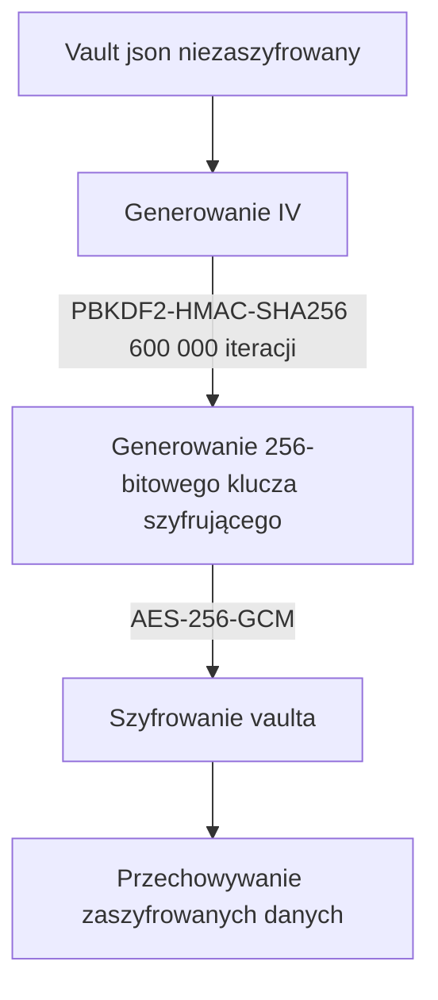
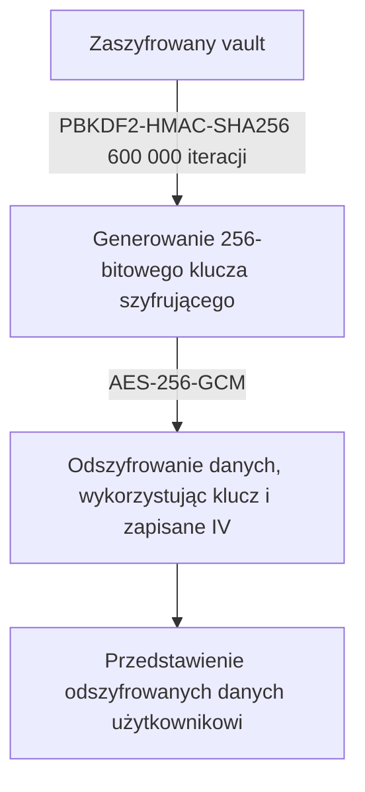
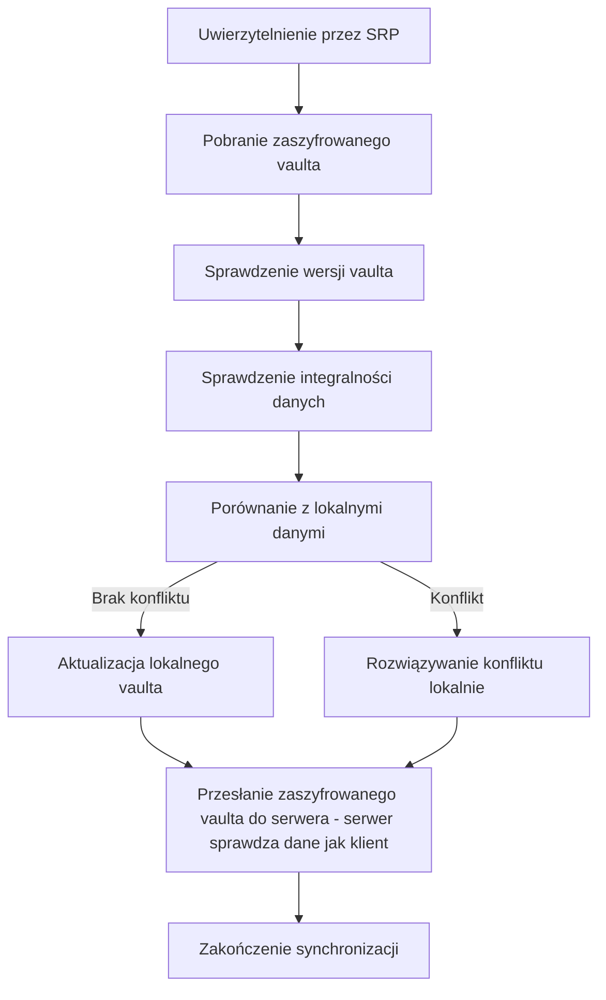

## Cel Projektu
Celem jest stworzenie wieloplatformowej aplikacji (Windows/Linux) do bezpiecznego
przechowywania haseł. Kluczowym założeniem jest architektura Zero-Knowledge: serwer
służy wyłącznie do synchronizacji zaszyfrowanych danych i nigdy nie ma dostępu do haseł
użytkownika ani kluczy szyfrujących.

## Model Bezpieczeństwa
- **Zero-Knowledge**: Hasło główne (Master Password) nigdy nie opuszcza urządzenia
użytkownika.
- **End-to-End Encryption**: Dane są szyfrowane lokalnie przed wysłaniem na serwer.
- **Uwierzytelnianie:** Protokół SRP (Secure Remote Password) pozwala udowodnić
serwerowi znajomość hasła bez jego wysyłania.

## Rejestracja: 
- Użytkownik podaje dane (swój adres e-mail oraz hasło główne)
- Generowana jest sól przechowywana jawnie w bazie
- Generowany jest Secret Key (klucz losowy nie opuszczający urządzenia)
- Obliczany jejst SRP Verifier na bazie soli oraz hasła głównego
- Do serwera przesyłane są: 
	- Nazwa użytkownika
	- Sól
	- SRP Verifier ($verifier = g^{H(salt, password)} \pmod N$)
	- Publiczne parametry SRP (g - generator, N - liczba pierwsza) wykorzystywane do obliczeń modulo
- Master Password oraz Secret Key nigdy nie są przesyłane do serwera
- Tworzony jest lokalny vault do przechowywania haseł użytkownika

## Logowanie:
 - Użytkownik wprowadza swoje dane (e-mail oraz hasło główne)
 - Klient generuje wartość SRP verifier i przesyła do serwera
 - Serwer porównuje obliczoną przez użytkownika wartość z tą przechowaną w bazie danych, jeżeli wartości te się zgadzają następuje uwierzytelnienie
 - Klient nie musi mieć dostępu do serwera, może odblokować vault lokalnie z wykorzystaniem hasła głównego

- $A = g^a \pmod N$ 
- $B = (k \cdot v + g^b) \pmod N$ 
- $u = H(A, B)$ 
Ustalenie klucza: 
Klient : $S = (B - k \cdot g^x)^{(a + u \cdot x)} \pmod N$ 
Serwer : $S = (A \cdot v^u)^b \pmod N$ $K = H(S)$ 
Udowodnienie: $M1 = H(A, B, K)$ $M2 = H(A, M1, K)$



## Szyfrowanie/Odszyfrowywanie:
- Generowany jest klucz szyfrujący z użyciem PBKDF2-HMAC-SHA256
 ```python 
	DerivedKey = PBKDF2-HMAC-SHA256( 
	password = MasterPassword + SecretKey,
	salt = UserSalt,
	iterations = 600 000, 
	keylen = 256 bit 
	)
  ```

- Wykorzystując wygenerowany klucz szyfrujemy vault wykorzystując AES-256-GCM
- Struktura vault 
 ```json
{
  "user": "user",
  "version": 1,
  "salt": "user_salt",
  "createdAt": "date_time",
  "updatedAt": "date_time",
  "verificationToken": "ciphertext_base64",
  "verificationIV": "iv_base64",
  "verificationTag": "tag_base64",
  "vault": {
    "passwords": [
      {
        "password_id": 0,
        "metadata": {
          "site": "website",
          "category": "General",
          "note": "note",
          "favorite": false,
          "created": "date_time",
          "updated": "date_time"
        },
        "data": {
          "username": "username_ciphertext_base64",
          "username_iv": "username_iv_base64",
          "username_tag": "username_tag_base64",
          "password": "password_ciphertext_base64",
          "password_iv": "password_iv_base64",
          "password_tag": "password_tag_base64"
        }
      }
    ]
  }
}
  ```


- Aby odszyfrować dane potrzebne jest podanie hasła głównego, pozwala to na wygenerowanie klucza szyfrującego i odszyfrowanie bazy



## Synchronizacja
- Do synchronizacji musimy uwierzytelnić się z serwerem poprzez SRP
- Vault jest przesyłany jedynie w postaci zaszyfrowanej,
 ```json
{
    "user":"salt",
    "version": 1,
    "salt": "user_salt",
    "createdAt":"date_time",
    "updatedAt":"date_time",
    "verificationIV":"iv_base64",
    "verificationCiphertext":"ciphertext_base64",
    "verificationTag":"tag_base64",
    "vault":{
        "vault_iv":"iv_base64",
        "vault_ciphertext":"ciphertext_base64",
        "vault_tag":"tag_base64"
    }
}
  ```

- Najnowsza wersja zaszyfrowanego vault pobierana jest z serwera a wszelkie konflikty rozwiązywane są lokalnie


